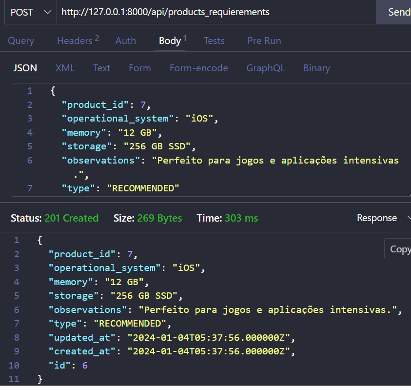

# Projeto "GAMING CHANNEL"

<p align="center">
  
</p>

Uma aplicação web que oferece funcionalidades semelhantes às da plataforma Steam. Isso inclui a gestão de biblioteca de jogos, compra e venda de títulos, integração de comunidade, chat, análise de desempenho, e outras características essenciais presentes em plataformas de jogos online.

## Índice

-   [Funcionalidades do Projeto](#funcionalidades)
-   [Documentação da API](#layout)
-   [Demostratração](#demostracao)
-   [Técnicas e padrões utilizadas](#tecnicas)
-   [Como rodar este projeto?](#rodar)
-   [Technologias Utilizadas](#technologias)
-   [Autora](#autora)
-   [Proximos passos](#passos)

<a name="funcionalidades"></a>

## Funcionalidades do Projeto

 ####  S01 - Products
- Cadastro de um produto
- Listagem de todos os produtos
- Atualização de um produto
- Deleção de um produto
- Visualização de um produto
 #### S02 - Markers
- Cadastro de um marcador
- Listagem de todos os marcadores
- Exclusão de um marcador
 #### S03 - Avaliações
- Cadastro de uma avaliação
- Listagem de todas as avaliações de um jogo
- Atualização de uma avaliação
- Deleção de uma avaliação

 #### S04 - Assets
- Cadastro de ativos de um jogo
- Listagem de todos os ativos
- Atualização de um ativo de um jogo
- Deleção de um ativo de um jogo
 #### S05 - Categories
- Cadastro de categoria
- Listagem de todas as categorias
- Atualização de uma categoria
- Deleção de uma categoria
 #### S06 - Achievements
- Cadastro de conquista
- Listagem de todas as conquistas de um jogo
- Atualização de conquista
- Deleção de uma conquista
 #### S07 - Product Requirements
- Cadastro de requisito
- Listagem de requisitos de um jogo
- Atualização de requisito
- Deleção de um requisito
<a name="layout"></a>

## Documentação da API

### Endpoints - Rotas

#### S01 - Products


> Cadastro: `HTTP POST /api/products`

> Listagem: `HTTP GET /api/products`

> Atualização: `HTTP PUT /api/products/:id`

> Deleção: `HTTP DELETE /api/products/:id`

> Visualização: `HTTP GET /api/products/:id`

**Exemplo de Cadastro**

<p align="center">

</p>

| Parâmetro    | Tipo     | Descrição                                        |
| ------------ | -------- | :----------------------------------------------- |
| `id`         | `int`    | **Autoincremental** . Chave primaria             |
| `name`       | `string` | **Obrigatório** . Nome do jogo,único               |
| `price`      | `decimal` | **Obrigatório** . Default:0       |
| `description` | `string` | **Obrigatório** . Description do jogo           |
| `cover`        | `string` | **Obrigatório** . Cover usado no jogo |         |

Request JSON exemplo

```http
{
  "name": "RimWorld",
  "price": "14",
  "description" : "Un simulador de colonias de ciencia ficción dirigido por una brillante Inteligencia Artificial que narrará la historia. Genera historias al simular psicología, ecología, combate, clima, biomas, diplomacia, relaciones interpersonales, arte, medicina, comercio y mucho más.",
  "cover": "Cover Sky"
}
```

| Response Status | Descrição       |
| --------------- | :-------------- |
| `200`           | sucesso         |
| `400`           | dados inválidos |

</p>

#### S02 - Markers
##### S02.1- Tabela markers


> Cadastro:`HTTP POST /api/markers`

> Listagem: `HTTP GET /api/markers`

> Deleção: `HTTP DELETE /api/markers/:id`

**Exemplo de Cadastro**

<p align="center">

</p>

| Parâmetro  | Tipo     | Descrição                          |
| ---------- | -------- | :--------------------------------- |
| `id`         | `int`    | **Autoincremental** . Chave primaria |
| `name`       | `string` | **Obrigatório** . Nome do marcador de um jogo,único       
| `color`    | `string` | **Obrigatório** . Color do marcador de um jogo |

Request JSON exemplo

```http
{
  "name": "Novo",
  "color": "#FFF1F1",
  "updated_at": "2024-01-04T02:07:49.000000Z",
  "created_at": "2024-01-04T02:07:49.000000Z",
  "id": 6
}
```

| Response Status | Descrição       |
| --------------- | :-------------- |
| `201`           | sucesso         |
| `400`           | dados inválidos |

</p>

##### S02.2- Tabela products_markers


> Cadastro:`HTTP POST /api/product_markers`

> Listagem: `HTTP GET /product_markers/{product_id}`

> Deleção: `HTTP DELETE /api/product_markers/{product_id}/{marker_id}`

**Exemplo de Cadastro**

<p align="center">

</p>

| Parâmetro  | Tipo     | Descrição                          |
| ---------- | -------- | :--------------------------------- |
| `id`         | `int`    | **Autoincremental** . Chave primaria |
| `product_id`       | `int` | **Obrigatório** . Id do jogo,único |      
| `marker_id`    | `int` | **Obrigatório** . Id do marcador de um jogo |

Request JSON exemplo

```http
{    
    "product_id": 6,
    "marker_id": 1,
    "created_at": "2024-01-04T02:45:05.000000Z",
    "updated_at": "2024-01-04T02:45:05.000000Z",
    "id": 12
}
```

| Response Status | Descrição       |
| --------------- | :-------------- |
| `201`           | sucesso         |
| `400`           | dados inválidos |

</p>

#### S03 - Avaliações


> Cadastro: `HTTP POST /api/avaliations`

> Listagem: `HTTP GET /api/avaliations/{product_id}`

> Atualização: `HTTP PUT /api/avaliations/:id`

> Deleção: `HTTP DELETE /api/avaliations/:id`

**Exemplo de Cadastro**

<p align="center">

</p>

| Parâmetro  | Tipo     | Descrição                          |
| ---------- | -------- | :--------------------------------- |
| `id`         | `int`    | **Autoincremental** . Chave primaria |
| `product_id`       | `int` | **Obrigatório** . Id do jogo|       
| `description`    | `string` | **Obrigatório** . Descrição da avaliação |
| `recommended`    | `boolean` | **Obrigatório** .  |

Request JSON exemplo

```http
{
  "product_id": 7,
  "description": "Desenvolvimento de habilidades como atenção, criatividade, memória",
  "recommended": true,
  "updated_at": "2024-01-04T03:22:33.000000Z",
  "created_at": "2024-01-04T03:22:33.000000Z",
  "id": 5
}
```

| Response Status | Descrição       |
| --------------- | :-------------- |
| `201`           | sucesso         |
| `400`           | dados inválidos |

</p>

#### S04 - Assets


> Cadastro: `HTTP POST /api/products_assets`

> Listagem: `HTTP GET /api/api/products_assets/?product_id=:id`

> Atualização: `HTTP PUT /api/products_assets/:id`

> Deleção: `HTTP DELETE /api/products_assets/:id`

**Exemplo de Cadastro**

<p align="center">

</p>

| Parâmetro  | Tipo     | Descrição                          |
| ---------- | -------- | :--------------------------------- |
| `id`         | `int`    | **Autoincremental** . Chave primaria |
| `product_id`       | `int` | **Obrigatório** . Id do jogo|       
| `name`    | `string` | **Obrigatório** . Nome do ativo |
| `url`    | `string` | **Obrigatório** . Url do ativo |
| `type_games_assets`    | `string` | Valores:'VIDEO','IMAGEN'|

Request JSON exemplo

```http
{
  "product_id": 7,
  "name": "Ambient Background Music Pack",
  "url": "https://assetstore.unity.com/packages/audio/ambient/ambient-background-music-pack-vol-1-220474",
  "type": "VIDEO",
  "updated_at": "2024-01-04T03:55:04.000000Z",
  "created_at": "2024-01-04T03:55:04.000000Z",
  "id": 4
}
```

| Response Status | Descrição       |
| --------------- | :-------------- |
| `201`           | sucesso         |
| `400`           | dados inválidos |

</p>

#### S05 - Categories


> Cadastro: `HTTP POST /api/categories`

> Listagem: `HTTP GET /api/categories`

> Atualização: `HTTP PUT /api/categories/:id`

> Deleção: `HTTP DELETE /api/categories/:id`

**Exemplo de Cadastro**

<p align="center">

</p>

| Parâmetro  | Tipo     | Descrição                          |
| ---------- | -------- | :--------------------------------- |
| `id`         | `int`    | **Autoincremental** . Chave primaria |      
| `name`    | `string` | **Obrigatório** . Nome da categoria do jogo|
| `description`    | `string` | **Obrigatório** . Description da categoria do jogo |

Request JSON exemplo

```http
{
    "name": "Puzle",
    "description": "É um jogo de peças que, quando dispostas de forma ordenada, formam uma figura.",
    "created_at": "2024-01-04T04:35:53.000000Z",
    "updated_at": "2024-01-04T04:35:53.000000Z",
    "id": 6
}
```

| Response Status | Descrição       |
| --------------- | :-------------- |
| `201`           | sucesso         |
| `400`           | dados inválidos |

</p>

#### S06 -  Achievements


> Cadastro: `HTTP POST /api/achievements`

> Listagem: `HTTP GET /api/achievements?product_id=:id`

> Atualização: `HTTP PUT /api/achievements/:id`

> Deleção: `HTTP DELETE /api/achievements/:id`

**Exemplo de Cadastro**

<p align="center">

</p>

| Parâmetro  | Tipo     | Descrição                          |
| ---------- | -------- | :--------------------------------- |
| `id`         | `int`    | **Autoincremental** . Chave primaria |  
| `product_id`       | `int` | **Obrigatório** . Id do jogo| 
| `url`    | `string` | **Obrigatório** . Url da conquista |    
| `name`    | `string` | **Obrigatório** . Nome da conquista do jogo. Unico|
| `description`    | `string` | **Obrigatório** . Description da conquista do jogo |

Request JSON exemplo

```http
{
  "name": "Troféu de bronze",
  "description": "Derrote 100 inimigos em combate corpo a corpo sem receber dano.",
  "url": "https://cdn.cloudflare.steamstatic.com/steam/apps/2325281/capsule_sm_120.jpg?t=1697536842",
  "product_id": 7,
  "updated_at": "2024-01-04T05:04:47.000000Z",
  "created_at": "2024-01-04T05:04:47.000000Z",
  "id": 13
}
```

| Response Status | Descrição       |
| --------------- | :-------------- |
| `201`           | sucesso         |
| `400`           | dados inválidos |

</p>

#### S07 -  Product Requirements


> Cadastro: `HTTP POST /api/products_requierements`

> Listagem: `HTTP GET /api/products_requierements?product_id=:id`

> Atualização: `HTTP PUT /api/products_requierements/:id`

> Deleção: `HTTP DELETE /api/products_requierements/:id`

**Exemplo de Cadastro**

<p align="center">

</p>

| Parâmetro  | Tipo     | Descrição                          |
| ---------- | -------- | :--------------------------------- |
| `id`         | `int`    | **Autoincremental** . Chave primaria |  
| `product_id`       | `int` | **Obrigatório** . Id do jogo| 
| `memory`    | `string` | **Obrigatório** . Memória necessária para usar o jogo |    
| `storage`    | `string` | **Obrigatório** . Memória necessária para usar o jogo|
| `observations`    | `string` | **Obrigatório** . Descrição   do requisito |
| `type`    | `string` | Valores:'MINIMUNS','RECOMMENDED'|

Request JSON exemplo

```http
{
  "product_id": 7,
  "operational_system": "iOS",
  "memory": "12 GB",
  "storage": "256 GB SSD",
  "observations": "Perfeito para jogos e aplicações intensivas.",
  "type": "RECOMMENDED",
  "updated_at": "2024-01-04T05:37:56.000000Z",
  "created_at": "2024-01-04T05:37:56.000000Z",
  "id": 6
}
```

| Response Status | Descrição       |
| --------------- | :-------------- |
| `201`           | sucesso         |
| `400`           | dados inválidos |

</p>

## Demostratração

[Assista ao vídeo](https://youtu.be/rsHrvXh_Ab4)

<a name="tecnicas"></a>

## Técnicas e padrões utilizadas

O projeto foi dividido em uma estrutura de pastas para organizar os models, controllers e database

<p align="center">

| Local            |                   Uso                   |
| ---------------- | :-------------------------------------: |
| /src/models      |    Contém todos modelos da aplicação    |
| /src/controllers |  Contém todos controllers da aplicação  |
| /src/database    | Contém todas as migrations da aplicação |

### Modelagem da base de dados PostgreSQL

> Foi utilizado o app https://dbdiagram.io/ para modelagem previa da base postgresql.

<p align="center">

</p>

### Acesse a documentação do modelo

> https://dbdiagram.io/d/steam-65964807ac844320ae3721bf

### Organização de etapas e cronograma

> https://trello.com/c/U9QeI8q6/122-m2s07-ex01-criando-projeto

</p>

<a name="rodar"></a>

## Como rodar este projeto?

### APP

```bash
# Clone este repositório
$ https://github.com/ElianaMT/Eliana-defensa-ex-sem07

# Crie uma base de dados no PostgreSQL com nome api_steam
$ base de dados PostgreSQL com nome api_steam

# Crie um arquivo .env na raiz do projeto com os seguintes parametros
DB_CONNECTION=''
DB_HOST=''
DB_PORT=''
DB_DATABASE=''
DB_USERNAME=''
DB_PASSWORD=''

# Instale as dependencias
$ npm install

# Execute a aplicação
$ npm start
```

<a name="technologias"></a>

## Technologias Utilizadas

1. [PHP](https://www.php.net/)
2. JavaScript
3. [Laravel](https://laravel.com/)

<a name="autora"></a>

## Autora

<p align="center">

</p>

[Linkedin](https://www.linkedin.com/in/eliana-morillo-t-48888569/)

<a name="passos"></a>

## Proximos passos

-   [ ] Implementar compra e venda de títulos.
-   [ ] Implementar integração de comunidade.
-   [ ] Implementar chat.
-   [ ] Implementar análise de desempenho.
 
